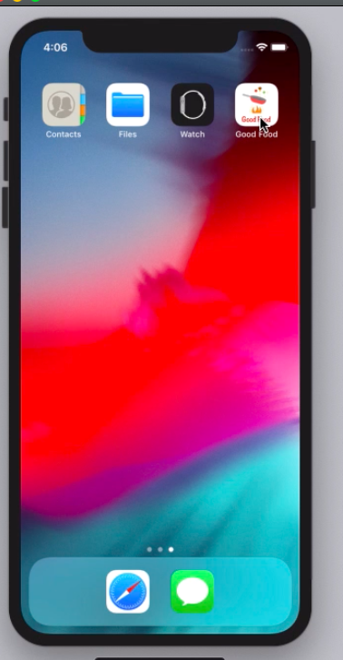
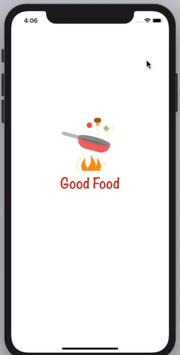
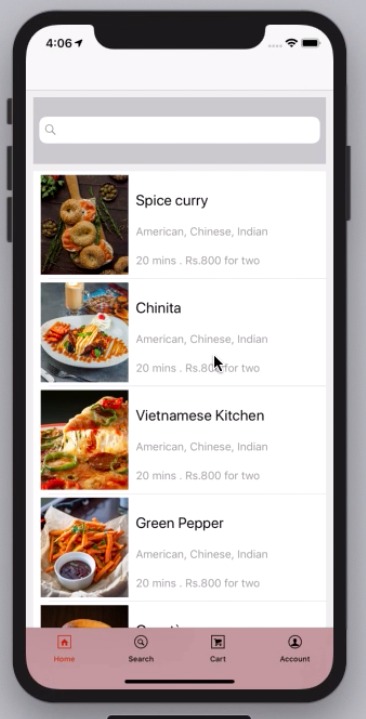

# foodOrderApp
Client App related to the Good Food App

This is a Food delivery App. It comprises of total three parts: 
1. Client's App, using which the client orders food (foodOrderApp)
2. Restaurant's App, using which the restaurant receives, approves and processes the order (foodOrderRestaurantPartnerApp)
3. Delivery Partner's App, through which the delivery partner gets a notification of a new order (foodOrderDeliveryPartnerApp)

On the launch of the App, client can select a restaurant from a list of restaurants around him, select the food items and place the order. On placing the order, the concerned restaurant partner receives the order. After the restaurant approves the order the client receives a confirmation and the delivery partner receives the order.
The client can track the location of the delivery partner and receives notifications about his order.
The delivery partner is guided with route maps towards the restaurant/client location using Apple Maps.
This project is developed using Swift 5, Xcode 10.2,RESTful API to connect to the backend services, CoreLocation, MapKit and Socket.IO frameworks

YouTube Link for Demo: https://youtu.be/KqbyJOZmzoM

 
 

